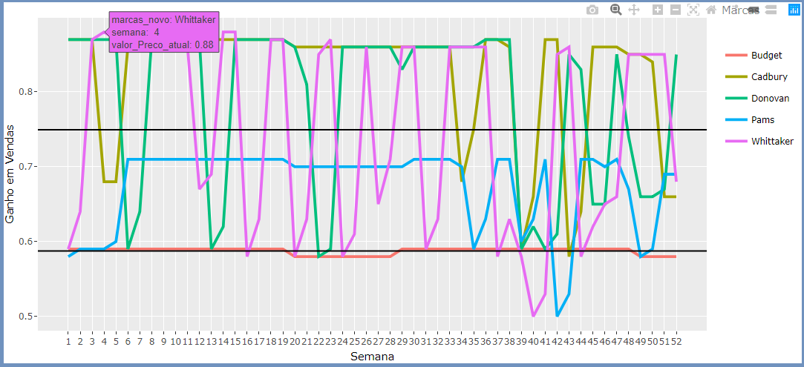

<h5><a href="blank_">[en]</a> | <a href="blank_">[pt-br]</a>
</h5>
<h5>

  <table>
    <tr>
      <th>PROJETO</th>
      <th>OBJETIVO</th>
      <th>TIPO DE DADOS</th>
    </tr>
    <tr>
      <td>Marketing Analytics do Zero</td>
      <td>Aplicar estatística descritiva, Análise de Regressão e Modelos básicos de Séries Temporais</td>
      <td>Time Series</td>
    </tr>
    <tr>
        <td colspan="4">LinkedIn : https://www.linkedin.com/in/claudineien/</td>
    </tr>
  </table>

</h5>

<h2>AULA 4 - MARKETING ANALYTICS</h2>
<h4>DATASET VENDAS CHOCOLATE</h4>
<h4>ANÁLISE DESCRITIVA</h4>

A análise descritiva é o coração da análise estatística.

Utilizaremos o dataset <a href="https://github.com/claudineien/marketing-analytics-gretl-r/tree/main/2-dataset">BD_marcas_de_chocolate.csv</a> ou <a href="https://github.com/claudineien/marketing-analytics-gretl-r/tree/main/2-dataset">BD_marcas_de_chocolate.xlsx</a> com dados agregados de todas as informações consolidadas das vendas de determinadas marcas de chocolate de todas as lojas de uma grande rede de varejo dentro de um período de 104 semanas, aproximadamente dois anos.

Estes dados se caracterizam como Time Series (Serie Temporal) por que ocorrem dentro de um determinado tempo, prazo controlado por semana.

Modelos inferenciais são modelos de dependência como por exemplo análise de regressão. Nestes há variáveis que são dependentes/respostas de variáveis independentes/explicativas. 
Por exemplo : A variável Vendas_Budget é a variável dependente/resposta, que depende das outras variáveis independentes/explicativas que explicam o seu resultado.

Serão gerados estatísticas descritivas no software <strong>RStudio em Fontes de estudo</strong> utilizando a linguagem R e o documento <a href="https://github.com/claudineien/marketing-analytics-gretl-r/tree/main/0-documentation">01-Report_Descritivo-atualizado_0411.docx</a> como apoio para analisar as média, mediana, desvio-padrão, coeficiente de variação, no primeiro ano e no segundo ano por marca e extrair outras informações.

Importante :  
Dentro do fonte <a href="https://github.com/claudineien/marketing-analytics-gretl-r/tree/main/1-source-code">Marketing Analytics - Preco_atual.R</a> estão anotados muitos outros detalhes. 
Aqui mencionei os que eu julguei conceitualmente importantes relacionados ao Marketing Analytics.

A Instrução <strong>s = summary(dados_choc)</strong> exibirá os valores minimo, 1o quartil, mediana, media, 3o quartil, valor máximo por coluna-variavel. 
Analisando a coluna Vendas_Budget valores em kilo entendemos : 
62.32 : vendas mínimas 
88.13 : vendas que alcançaram o 1o quartil/25% do total 
96.23 : vendas que alcançaram aproximadamente 50% das vendas 
95.53 : vendas médias ou ponto de equilíbio 
103.36 : vendas que alcançaram 3o quartil/75% do total 
132.00 : vendas máxima 
Os valores exibidos serão parecidos com a imagem a seguir : 
 
O comando <strong>d = describe(dados_choc)</strong> exibirá alguns dados resumidos por coluna-variável. Na coluna Vendas_Budget por exemplo : 
n = 104 : quantidade de elementos = linhas que contém dados para esta coluna 
missing = 0 : não há dados faltantes para esta coluna 
distinct = 99 : 99 valores de dados iguais 
Interessante saber que são informados valores a cada 1/2% a partir de 0.05 à 0.95. 
lowest : são os 5 menores valores 
highest : são os 5 maiores valores 
value : lowest + highest 
frequency : quantidade absoluta a cada lowest e highest do total 
proportion : proporção absoluta a cada lowest e highest do total 
Os valores exibidos serão parecidos com a imagem a seguir : 
 

Estes valores podem ser representados graficamente pelo gráfico boxplot. Conforme a seguir : 
 
Observar que o 2o quartil esta mais próximo do primeiro do que do terceiro significando que a distribuição é assimétrica negativa e indica que as vendas se concentram mais nos maiores valores.

Importante :  
Dentro do fonte <a href="https://github.com/claudineien/marketing-analytics-gretl-r/tree/main/1-source-code">Marketing Analytics - Preco_atual.R</a> estão anotados muitos outros detalhes. 
Aqui mencionei os que eu julguei conceitualmente importantes relacionados ao Marketing Analytics.

Considerando os dois anos que estão no dataset vamos plotar gráfio time series para analisar coluna-variável Preço_atual de cada marca :  
 
 
No gráfico é possível verificar que o preço não varia muito na marca Budget em relação às outras marcas. 

Importante :  
Interpretação econônica e mercadológica : O segredo da relação entre o preço e as vendas esta na variação do preço, e não no preço baixo. 
A variabilidade do preço influência no resultado das vendas.

Analisar em um gráfico dinâmico que ao passar o mouse são exibidas as informações programadas de um perído das primeiras 52 semana por marca. 
 
Possível entender que um desvio padrão interno de uma marca é maior que o desvio padrão interno da outra marca. 
Quando pegamos várias observações ao longo do tempo analisamos os dados que é conhecido como painel, considerando dois desvios-padrão : 1 a variabilidade do interior das observações e o desvio-padrão between que é o desvio padrão entre as observações para cada período de tempo. 

Analisar evolução do preço atual de chocolate por semana em um gráfico dinâmico de área que ao passar o mouse são exibidas as informações programadas de um perído das primeiras 52 semana por marca. 
 

  

Fontes de estudo
    <ul>
        <li>Aula 04 : <a href="https://youtu.be/6VoKWYZdBzg">Marketing Analytics</a> - Instrutores : Prof. Thiago Marques(USP/IBGE) e Marcos Severo (UFG)</li>
        <li><a href="https://cran.r-project.org/bin/windows/base/">Download R 4.0.3 Core for Windows</a></li>
        <li>Download Software RStudio <a href="https://rstudio.com/products/rstudio/download/">RStudio</a></li>
    </ul>

