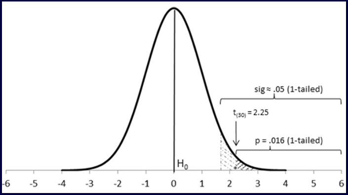

<h5><a href="blank_">[en]</a> | <a href="blank_">[pt-br]</a>
</h5>
<h5>

  <table>
    <tr>
      <th>PROJETO</th>
      <th>OBJETIVO</th>
      <th>TIPO DE DADOS</th>
    </tr>
    <tr>
      <td>Marketing Analytics do Zero</td>
      <td>Aplicar estatística descritiva, Análise de Regressão e Modelos básicos de Séries Temporais</td>
      <td>Time Series</td>
    </tr>
    <tr>
        <td colspan="4">LinkedIn : https://www.linkedin.com/in/claudineien/</td>
    </tr>
  </table>

</h5>

<h2>AULA 6 - MARKETING ANALYTICS</h2>
<h4>DATASET VENDAS CHOCOLATE</h4>
<h4>INTERPRETAR RESULTADO DO RELACIONAMENTO ENTRE AS VARIÁVEIS MERCADOLÓGICAS</h4>

A análise descritiva é o coração da análise estatística.

Desempenho Mercadológico é o coração do Marketing Analytics.

Utilizaremos o dataset <a href="https://github.com/claudineien/marketing-analytics-gretl-r/tree/main/2-dataset">BD_marcas_de_chocolate.csv</a> ou <a href="https://github.com/claudineien/marketing-analytics-gretl-r/tree/main/2-dataset">BD_marcas_de_chocolate.xlsx</a> com dados agregados de todas as informações consolidadas das vendas de determinadas marcas de chocolate de todas as lojas de uma grande rede de varejo dentro de um período de 104 semanas, aproximadamente dois anos.

Estes dados se caracterizam como Time Series (Serie Temporal) por que ocorrem dentro de um determinado tempo, prazo controlado por semana.

Modelos inferenciais são modelos de dependência como por exemplo análise de regressão. Nestes há variáveis que são dependentes/respostas de variáveis independentes/explicativas. 
Por exemplo : A variável Vendas_Budget é a variável dependente/resposta, que depende das outras variáveis independentes/explicativas que explicam o seu resultado.

Utilizaremos o documento <a href="https://github.com/claudineien/marketing-analytics-gretl-r/tree/main/2-dataset">01-Report_Descritivo-atualizado_0411.docx</a> para analisar conteúdo relacionado às variáveis de desempenho e entender como o as variáveis de marketing influenciam o desempenho mercadológico. A seguir parte do documento que será analisado: 

Utilizaremos o software <a href="http://gretl.sourceforge.net/pt.html">Gretl</a> para nos ajudar na interpretação dos resultados do relacionamento entre as variáveis mercadológicas.

<strong>Correlação Preco Atual versus Vendas</strong>

A primeira análise será sob a correlação linear entre duas variáveis quantitativas utilizando um gráfico de dispersão. As variáveis serão : Preco_atual_Whittaker no eixo X e Vendas_Whittaker no eixo y. 
 
Ainda não foi realizado a medida de relacionamento por ainda não ter feito uma análise de correlação entre estas variáveis, mesmo assim o gráfico permite identificar o relacionamento entre as variáveis, que neste caso é um relacionamento negativo. 
A linha gerada é a linha dos mínimos quadrados ordinários também conhecida como linha de melhor ajuste. Esta linha possibilita mostrar a menor distância entre ela e os pontos. 
Este relacionamento é negativo do ponto de vista das vendas, por que o aumento das variáveis de preço no eixo X diminui as variáveis vendas no eixo y, que significa preço alto menos vendas. 
Sob a teoria de marketing este relaçionamento faz sentido, é esperado e é estabelecido pela 'lei da demanda na microeconomia'.

A análise de correlação nos dá um número, uma medida para identificarmos a força do relacionamento entre as variáveis.

Correlação é uma medida de força padronizada variando de -1 a 1, independente da variável que se use. Esta forma padronizada permite comparar o objeto 'laranja' com 'laranja'. A corrélação é uma associação linear entre as variáveis em que analisa se uma variável 'sobe' a outra 'desce' em relação a que esta 'subindo' ou vice-versa ou se ambas estão paralelas 'subindo' ou 'descendo'.

-1 é correlação negativa forte e 1 é correlação positiva forte, conforme a prosimando de zero a correlação é fraca, quando alcança zero a correlação é inexistente.

É importante lembrar que somente associações não indicam causalidade.

Caso o objetivo seja utilizar uma medida de força não padronizada, devemos utilizar a covariância.

Variância leva ao desvio padrão e covariância leva a correlação.

A teoria é quem indica dependência em que X depende de y por exemplo. 
A teoria também indica dependências que podem não fazer sentido como por exemplo 'vendas de sorvete e ataque de tubarão na praia'. Neste caso há uma terceira variável não mencionada mas influência diretamente nesta relação. Esta terceira variável é conhecida como variável Z e é a temperatura. Significa que quando aumenta a temperatura, mais pessoas vão a praia, mais pessoas entram no mar, mais pessoas estão suscetíveis a ataque de tubarão. Aqui temos a correlação espúria.

<strong>Correlação espúria</strong> é o nome que se dá para a existência de relação estatística entre duas ou mais variáveis, mas sem significado teórico, seja pelo acaso ou por um terceiro fator

Atenção com variáveis ao longo do tempo, por que o tempo pode funcionar como uma terceira variável 'Z' influenciando a relação entre duas várias.

A figura a seguir mostra a Matriz de Correlação e o teste de hipótese : 
 
Uma correlação entre vendas e preço foi realizada e o valor desta correlação é -0.7660. 
O teste t com dois graus de liberdade, por ser dois anos é igual a -12.035 
Estatística de teste com valor negativo 
A distribuição t se assemelha a distribuição normal padrão 
A correlação de -0.7660 esta a mais de 12 desvios padrão do valor de zero e o valor de p é muito pequeno. 
Aqui podemos cometer o erro tipo que é falar que há correlação mas não há. 
-0.7660 é inferior ao 5% de grau de significância e entra na rejeição da hipótese nula e permite afirmar que há correlação negativa entre as variáveis venda e preço, que significa que quando o preço aumenta a venda diminui.

Os graus de significância padrão estabelecido pela estatística são 10%, 5% e 1%.

Todas as decisões inferênciais em estatística são baseadas em teste de hipótese.

Vamos entender o que é hipótese : 
Hipótese nula é o mesmo que status quo, sem mudanças, sem acontecimentos, isto é, a correlação igual a zero. 
Hipótese alternativa é o que você testa contra a hipótese nula para verificar se algo esta acontecendo, isto é, correlação é diferente de zero.

Vamos entender o que é rejeitar ou aceitar a hipótese nula : 
Testar o valor da correlação que obtivermos entre as duas variáveis contra zero (hipótese nula). Se este valor estiver muito distante de 0 negativamente ou positivamente então rejeitamos a hipótese nula, isto é, algo esta acontecendo então temos a hipótese alternativa. 
O valor muito distante significa a probabilidade é muito pequena, fora do intervalo de confiança a ponto de rejeitarmos a hipótese nula a favor da hipótese alternativa. 
A figura a seguir mostrar o Teste Bilateral usado para ver se a média real da amostra não é igual ao que é reivindicado na média da hipótese. 
 
A parte central também é conhecida como nível de confiança, a parte mais a esquerda e a parte mais a direita também são conhecidos de alfa ou nível de significância do teste. 
Se o valor da estatística de teste associado ao valor de probabilidade estiver na parte central aceita a hipótese nula, caso este valor seja muito distante de 0 negativamente (à esquerda) ou positivamente (á direita) então rejeitamos a hipótese nula que significa que há correlação entre as variáveis. 
O alfa é definido por nós e isto significa que confiamos 95% e 5% é a significância para rejeitar ou aceitar a hipótese nula. 
O alfa depende muito do negócio em que uma hipótese esta sendo testada.

A imagem a seguir mostrar a Matriz de Correlação das demais marcas para analisarmos o contexto geral : 
 
É possível identificar que a marca Donavan tem suas vendas mais influenciadas pelo preço do que as outras marcas, por que sua correlação é negativamente mais forte. 
Também é possivel identificar que a marca Pams tem suas vendas menos influenciadas pelo preço do que as outras marcas, por que sua correlação é negativamente mais fraca.

Ao gerar o gráfico de dispersão da marca Budget percebemos que não á linha de melhor ajuste, por que não há variação entre as variáveis.
 
Para acontecer um gráfico de dispersão as variáveis devem variar para conseguirmos capturar a dispersão. 
A análise de correlação diz que conforme X se distância em relação a média y se distância em relação a média também. 
Por exemplo :
Correlação negativa que dizer : enquanto as vendas se distanciam em relação a média positivamente o preço se distância em relação a sua própria média negativamente.

A Matriz de Correlação da Budget
 
A correlação de -0.1070 é muito fraca e não foi estatística significativa, por que seu p-value de 0.2796 esta acima de 0.05 que é a significância, então a é hipótese é nula, que não há correlação significativa entre as variáveis preço e venda e que o preço não influencia as vendas. 
Por fim podemos considerar que correlação igual a 0 'zero', por estar a correlação muito próxima de 0.

<strong>p-value</strong> : Para reforçar o entendimento, utilizaremos a imagem da distribuição normal a seguir :
 
O p-value é uma pequena área debaixo da curva (ou calda). Se o p-value for inferior a alfa rejeitamos a hipótese nula (H0) e aceitamos hipótese alternativa (Ha), se o p-value for superior a alfa aceitamos a hipótese nula. 
O p-value existe tanto na calda à esquerda quanto na calda à direita.

<strong>Correlação Vendas e Anúncio e Display</strong>

A seguir esta a Matriz de Correlação entre as variáveis Vendas e Anúncio e Display de todas as marcas, exceto da marca Budget que não possui varição alguma entre estas variáveis.
 
Analisando estes valores identificamos rapidamente que a Pams esta com uma correlação positiva e fraca bastante diferente das demais marcas.

Aqui entendemos melhor a importância da Estatística Descritiva ao fornecer indicios a construção de um modelagem.

  

Fontes de estudo
    <ul>
        <li>Aula 06 : <a href="https://youtu.be/fQkeDjgSSgs">Marketing Analytics</a> - Instrutores : Prof. Thiago Marques(USP/IBGE) e Marcos Severo (UFG)</li>
        <li><a href="https://www.youtube.com/channel/UCyYHddVgHXAwDJ27-JxWqBA">Vejo Marketing em tudo! / Marketing everywhere!</a></li>
    </ul>

